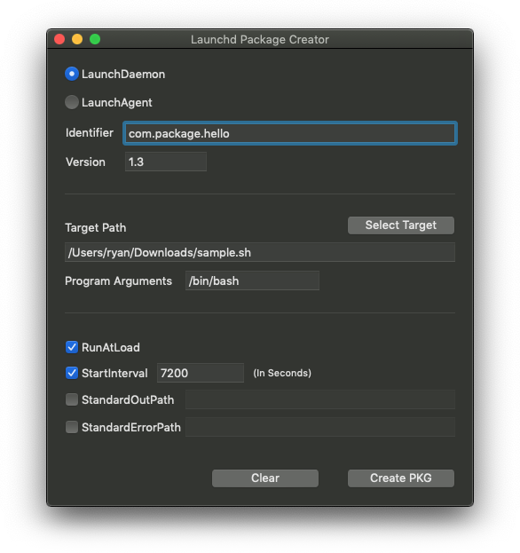

# launchd Package Creator
A utility that allows you to easily create a .pkg containing a LaunchDaemon or LaunchAgent, and a target script of your choosing. The target script is also packaged, so nothing else is required on the Mac.

    

